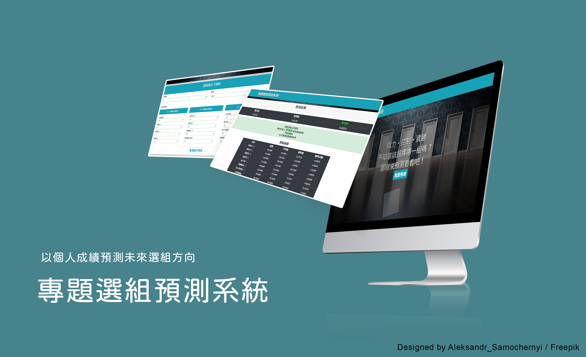

# 專題選組預測

## Overview

電機系學生在大二升大三將面臨畢業專題，要選擇領域分組(電力、控制、資通)，卻可能不清楚自己適合哪個領域，難以抉擇。本系統即是以過往學長姊的必修科目成績、選擇組別、專題分數為參考依據，藉由學生必修科目的成績來推測在三組分別獲得的專題成績，為學生提供參考。

## Usage

- train.py :

    用來進行訓練線性回歸模型，儲存成 List 輸出在 Console 上，可依需求在 service.py 中使用。

- service.py :

    用來做資料庫的增減，將模型及資料寫入資料庫。

- app.py :

    使用 Flask 當作網站框架，做為前端介面呈現。

- data.csv :

    做為輸入資料集，存放所有年度的所有學生的必修成績及專題成績。
